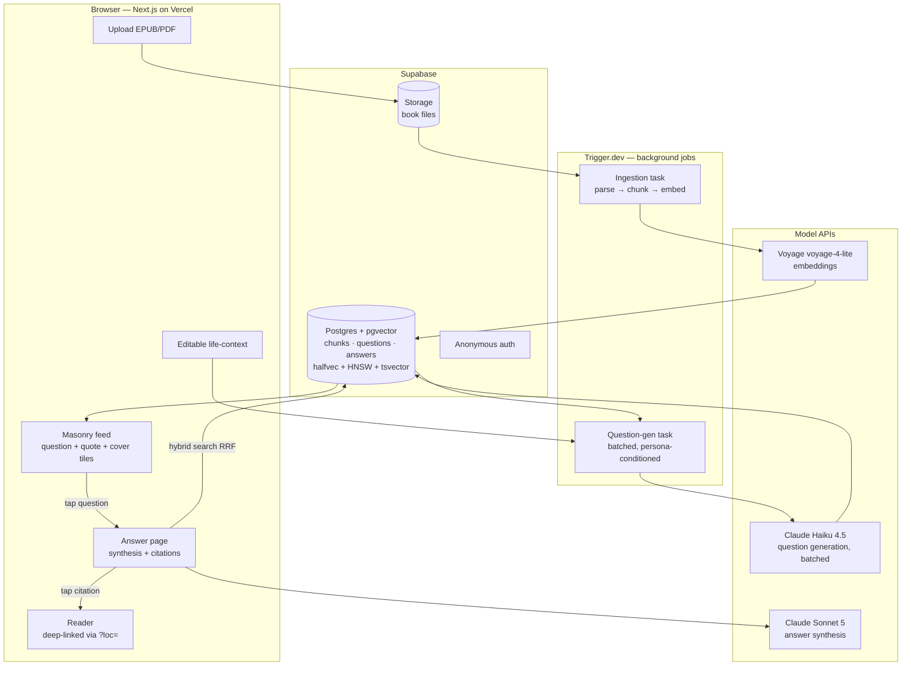

# Scrollwise Architecture

How a book becomes a feed. Companion to [V2_BRIEF.md](V2_BRIEF.md).

## System overview

## Module map (what exists today)

| Module | Role | Status |
|---|---|---|
| `lib/server/ingestion/` | EPUB/PDF → chapters/blocks → 400–512-token chunks (breadcrumbs, exact offsets, typed errors) | ✅ built, tested |
| `lib/server/scoring/` | Chunk quality scores → chapter-balanced quote tiles with sentence-aligned excerpts | ✅ built, tested |
| `lib/server/generation/` | Zod output schemas, grounded prompt builders, tolerant model-JSON parsing | ✅ built, tested |
| `lib/extraction/`, `lib/feed/`, reader | v1 client-side pipeline + reader UI (reader survives as citation destination) | ✅ v1 |
| Supabase schema + hybrid search | pgvector `halfvec(1024)` + HNSW, tsvector FTS, RRF fusion function | ⏳ next |
| Trigger.dev tasks | Wire ingestion + question-gen as durable jobs | ⏳ next |
| Feed UI (masonry) + answer page | Awaits brand direction | ⏳ next |

## Design invariants

1. **Grounded by construction** — questions are generated *from* passages (never free-floating),
   so every question is born with its receipts; answers cite every claim and admit gaps.
2. **Retrieval unit ≠ display unit** — chunks may start mid-sentence (embedding-optimal);
   anything user-facing is sentence-aligned (excerpts, quotes).
3. **Pure core** — everything in `lib/server/` is pure functions: no network, DB, or framework
   imports. I/O lives at the edges (jobs, API routes), which is what makes the core testable.
4. **Lazy where taps are, batched where volume is** — answers generate on tap (Sonnet);
   questions generate in cheap batches (Haiku via Message Batches API).
